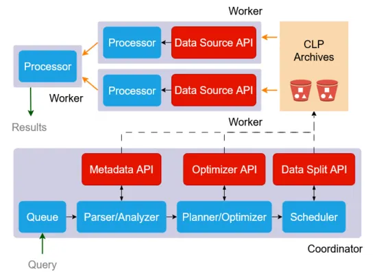

# Presto CLP Connector Plugins

A Presto connector to query [CLP](https://github.com/y-scope/clp) compressed logs.

## Overview

Presto is a distributed SQL query engine designed for running fast, interactive queries over large datasets from a variety of sources.
It's widely used to explore and join datasets from data lakes, data warehouses, and operational stores.

With the Presto CLP connector plugins, Presto can now work with semi-structured log data compressed in CLP format. We highlight the CLP connector's technical features that make querying semi-structured log data both faster and easier in [Presto RFC #37](https://github.com/prestodb/rfcs/pull/37).

The figure below shows the architecture of the CLP connector with Presto. Blue components are existing Presto components, whereas red components are connector interfaces exposed to CLP. The Presto CLP connector is composed of two plugins, categorized by where they are plugged into the Presto architecture:

- **[presto-connector](presto-connector)** — Java plugin for the Presto coordinator
- **[velox-connector](velox-connector)** — C++ plugin for the Velox engine used by Presto workers




## Requirements

- CMake 3.28+
- C++20 compatible compiler
- JDK 17
- [Maven] 3.8+
- [Task] 3.38.0+

## Releases

> **Warning**: 🚧 This section is still under construction.

## Building

See each plugin's README for build instructions:

- **[presto-connector](presto-connector/README.md)** — Java plugin (coordinator)
- **[velox-connector](velox-connector/README.md)** — C++ plugin (worker)

## Deploying with Existing Presto and Velox Instances

### 1. Deploy the Java Plugin

- Copy the Java plugin JAR into Presto's plugin directory:

    ```shell
    cp presto-clp/target/presto-clp-0.297.jar $PRESTO_HOME/plugin/
    ```

    Note that `$PRESTO_HOME` is the path to your Presto coordinator installation directory.

- Enable binary serialization codecs in `$PRESTO_HOME/etc/config.properties`:

    ```properties
    use-connector-provided-serialization-codecs=true
    ```

- **Restart the Presto coordinator** to load the plugin.

### 2. Deploy the C++ Plugin

- Configure the C++ worker with below configuration:

    ```properties
    # config.properties for C++ worker
    plugin.dir=/path/to/libpresto_clp_plugin.so
    ```

- **Restart the Presto worker** to load the plugin.


## Docs

> **Warning**: 🚧 This section is still under construction.

[Maven]: https://maven.apache.org/
[Task]: https://taskfile.dev

