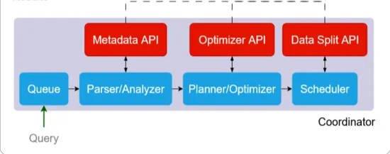

# Presto Connector

Java plugin for the Presto coordinator. 



This plugin implements the connector interfaces (red boxes in the diagram above) that allow Presto to query against the schemaless CLP format efficiently:

- Table and column resolution (Metadata API): These interfaces are necessary so that Presto can determine what tables (CLP datasets) exist, and what columns should be directly exposed in each table.

- Query plan optimization (Optimizer API): These interfaces are necessary so that the connector can rewrite the logical query plan to push down any operations that CLP can handle when searching the data in each archive.

- Splits retrieval (Data Splits API): These interfaces are necessary so that the connector can query CLP’s metadata database to retrieve and return the splits (CLP archives) relevant to a particular query.

## Requirements

* JDK 17
* [Maven] 3.8+
* [Task] 3.38.0+

## Building

```shell
task build
```

Or with Maven directly:

```shell
mvn package -DskipTests
```

## Testing

```shell
task test
```

## Linting

Before submitting a pull request, ensure you've run the linting commands below and either fixed any violations or suppressed the warnings.


### Running the linters

To run all linting checks:

```shell
task lint:check
```

To fix fixable issues and run static analysis:

```shell
task lint:fix
```

[Maven]: https://maven.apache.org/
[Task]: https://taskfile.dev

---
