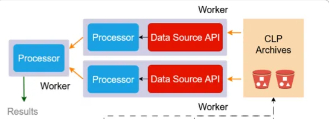

# Velox Connector

C++ plugin for Presto worker's Velox engine. 

A Presto query is executed in parallel across a fleet of worker nodes, each of which receives a query plan and a set of data splits from the Presto coordinator. Since [Presto 2.0](https://prestodb.io/blog/2024/06/24/diving-into-the-presto-native-c-query-engine-presto-2-0/), inside each worker, query execution is delegated to Velox — an open-source C++ library from Meta that serves as the underlying execution engine. Velox natively processes data as columnar vectors, promoting a vectorized, SIMD execution model that is far more performant than the legacy Java engine. To make CLP data accessible to Velox, we implement a C++ plugin that conforms to Velox's DataSource API, allowing the Presto worker's Velox engine to search CLP IR streams and archives.

